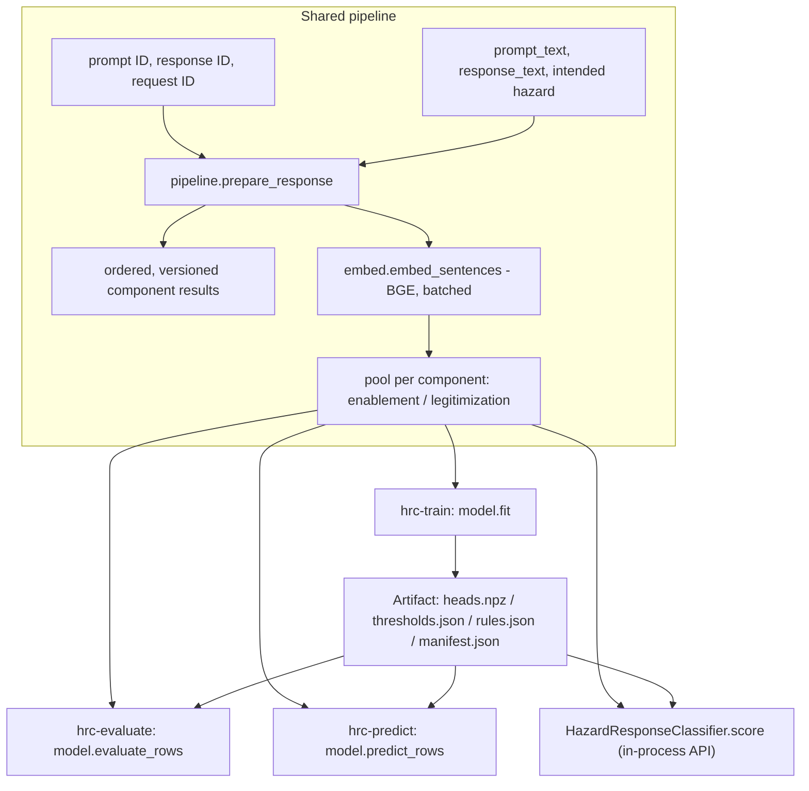

# Software architecture

## Module map

```
schema.py         Input CSV validation (mode-scoped required columns, hazard
                   normalization, label range checks). No knowledge of
                   hazard families — that requires a loaded artifact.
pipeline.py       Versioned component handoffs, datastore identity, and the
                   ordered upstream response-preparation workflow. Incomplete
                   components are explicit pass-through placeholders.
preprocess/
  decode.py        Pure decoding helper used by pipeline.py.
  segment.py       Pure sentence/bullet/code segmentation helper.
  flags.py         Pure prompt-repetition / disclaimer flag helpers.
embed.py           BGE sentence embedding (CPU-only) + mean pooling.
                   Production and legacy entry points share one internal
                   raw-text→features implementation.
heads.py           BinaryHead: standardize + logistic regression + centering.
                   No notion of hazard or component identity — fits/serves
                   one already-filtered, already-weighted binary head.
rules.py           Two independent rule families:
                   - ordinal_prediction / optimize_ordinal_thresholds
                     (monotonicity-gated combination of the two heads)
                   - resolve_component_action (predict-time fail-closed
                     resolution: not_required / fail_unseen_hazard /
                     fail_skipped_cell / score_zero / serve)
                   Plus hazard_family, discrete_v14_label, v14_overall_score,
                   apply_legitimization_disclaimer_rule.
metrics.py         component_metrics, final_label_metrics, holdout
                   partitioning, metrics.csv/summary.txt rendering.
model.py           Orchestration: fit, save/load (artifact I/O), score_row
                   (per-row predict/evaluate pipeline), evaluate_rows,
                   predict_rows, HazardResponseClassifier.score (the
                   in-process batch API).
cli/
  _common.py       Shared argparse pieces (--allow-download), fatal(),
                   the skipped-component load-time warning.
  train.py         hrc-train
  evaluate.py      hrc-evaluate
  predict.py       hrc-predict
config.py          Hazard-family sets (installed defaults only — never
                   consulted at predict/evaluate time; see below), the
                   default embedding model name, the head-fit random seed.
```

## One shared feature-building pipeline

Every entry point uses the same preprocess→embed→pool implementation.
`HazardResponseClassifier.score` calls the identity-bearing
`build_component_features`; the CSV CLIs call
`build_legacy_component_features`. Both delegate to the same internal
builder.



`pipeline.prepare_response` is the single upstream component workflow used by
the shared feature builder. Each component result records the component and
Assessment Standard versions, implementation status, input text, output text,
judgments, and the supplied datastore identity. The prepared response also
retains the supplied intended hazard as context for the future
hazard-detection component. A `placeholder` is enforced as a no-op: it must pass text
through unchanged and cannot emit judgments. The current hazard-detection,
narrative-analysis, and refusal-analysis entries are placeholders; their
presence does not change a score.

## Identity

Production requests use `EvaluationIdentity(prompt_id, response_id,
request_id)`. `prepare_response` requires it, and prepared responses,
component results, and final results return it unchanged. Segments inherit
identity from their response instead of repeating it. Text helpers such as
the decoder remain unaware of IDs.

The CSV CLIs keep their legacy `prompt_uid` row key and use an explicitly
unidentified adapter. They do not invent datastore IDs.

`model.score_row` is the shared per-row scoring function underneath
`evaluate_rows`/`predict_rows`/`score` — all three differ only in what they
do with a hard-fail row (`hrc-evaluate` excludes it and tallies a count;
`hrc-predict` and `score` route it to a separate failures/result entry and
continue).

## Artifact format

`hrc-train`'s output directory is the frozen contract between training and
everything downstream:

| File | Contents |
|---|---|
| `heads.npz` | Every fitted `BinaryHead`'s `mean`/`scale`/`coef`/`intercept`/`constant_probability`/`center_mean`/`status` arrays, keyed deterministically as `{component}__{hazard}__{nonzero,high}__{field}` |
| `thresholds.json` | Per-cell `status` (`"fit"`/`"skipped"`), `nonzero_threshold`, `high_threshold`, and the threshold search's own training-time metrics |
| `rules.json` | `trained_hazards`, `hazard_family` per hazard, and the artifact's own frozen `enablement_only_hazards`/`specialized_advice_hazards` sets |
| `manifest.json` | `holdout_seed_prompt_ids`, `skipped_components`, `embedding_model_name`/`revision`, the Assessment Standard/pipeline/component versions and statuses, plus optional provenance fields `hrc-train` fills in (`code_version`, `hyperparameters`, `training_timestamp`, `training_file_hash`, `training_row_count`, `training_hazard_counts`) |

Two deliberate architectural choices worth knowing about:

- **Hazard-family sets are read from the artifact, never installed
  `config.py` defaults, at predict/evaluate time (D-23).** `rules.json`
  freezes the exact sets the artifact was trained with. This is why
  `rules.py`/`metrics.py` take `enablement_only_hazards`/
  `specialized_advice_hazards` as required parameters everywhere, with no
  default that could silently fall back to whatever `config.py` says today —
  an artifact trained months ago must always score consistently with
  itself, even if `config.py`'s defaults change later.
- **No `joblib`, no pickle (D-6, D-37)** — the artifact is `.npz` + JSON
  only, and training always runs on CPU. Both were explicit choices to keep
  the artifact format simple, portable, and free of a pickle-based security
  surface.

## CLI layer

Each of the three CLIs is a thin wrapper: argparse → `schema.load_csv` →
(`model.load` for evaluate/predict) →
`embed.build_legacy_component_features` → one `model.py` orchestration call
→ file output. None of them contain business logic of their own — see
[`docs/howto/`](howto/) for each command's actual flags and outputs.
